# Use cases

In this document you will find a series of most common use cases when it comes to implementing the Customizations API on a LumApps site. These code snippets should give a clear idea of what the API is capable to do and provide several ideas on how to implement it.

**IMPORTANT:** these are just examples of the different scenarios where the Customizations API could be an adequate solution for it. They are not complete examples, and would definitely need to be adjusted/changed/rewritten in order to be compatible with your LumApps site.

## Adding a side navigation to the application

The following script uses the target `targets.APP` and the placement `placements.LEFT` or `placements.RIGHT` in order to create a side navigation that will be visible throughout the entire application, displaying links to Google's applications.

This use case can be extended and combined with the use case [Querying an external service](#querying-an-external-service) in order to retrieve the links to display in the side navigation from any service.

```js
window.lumapps.customize(({ targets, components, render, placement, session, constants }) => {
    const { Orientation, ColorPalette, Size } = constants;
    const items = [
        {
            name: {
                en: 'Google Drive',
                fr: 'Google Drive',
                es: 'Google Drive',
            },
            link: {
                en: 'https://drive.google.com/',
                fr: 'https://drive.google.com/',
                es: 'https://drive.google.com/',
            },
            thumbnail: 'https://upload.wikimedia.org/wikipedia/commons/d/da/Google_Drive_logo.png'
        },
        {
            name: {
                en: 'Google Meet',
                fr: 'Google Meet',
                es: 'Google Meet',
            },
            link: {
                en: 'https://meet.google.com/',
                fr: 'https://meet.google.com/',
                es: 'https://meet.google.com/',
            },
            thumbnail:
                'https://upload.wikimedia.org/wikipedia/commons/thumb/9/9b/Google_Meet_icon_%282020%29.svg/1024px-Google_Meet_icon_%282020%29.svg.png',
        },
    ];
    const { Link, FlexBox, Thumbnail, RawHTML } = components;

    render({
        placement: placement.LEFT,
        target: targets.APP,
        toRender: FlexBox({
            className: 'side-bar',
            orientation: Orientation.vertical,
            children: items.map((item) => {
                const name = item.name[session.language];
                const link = item.link[session.language];

                return Link({
                    children: [
                        Thumbnail({ className: 'app-link--image', image: item.thumbnail, size: Size.m }),
                        RawHTML({ html: `<span class="app-link--name">${name}</span>` }),
                    ],
                    href: link,
                    color: ColorPalette.primary,
                    className: 'app-link lumx-spacing-padding-big',
                });
            }),
        }),
    });
});
```

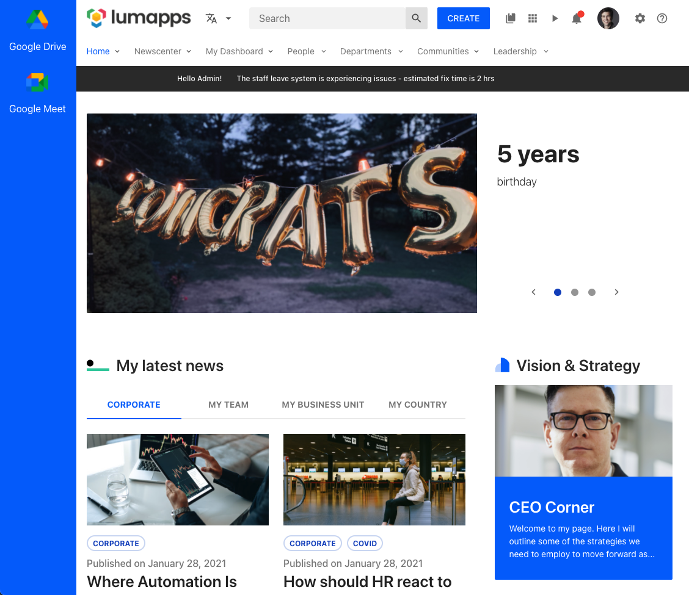

Here's the CSS used for this specific snippet, but you can use whatever CSS you want to customize your side nav. This is just an example.

```css
.side-bar {
    z-index: 10000; // make sure it displays above the site's header
    background: #0165FB;
    color: white;
    position: fixed;
    height: 100vh;
}

.app-link--name {
    color: white;
}

.app-link--image {
    margin-bottom: 16px;
}
```

**IMPORTANT:** This is just an example on how to use the Side navigation use case component. This is not a full working example, and adjustements might be needed for making this solution work on all pages while considering other LumApps use cases. You might encounter scenarios where the side navigation is overlapped with other components, and further CSS or JS code might be needed.

## Displaying a modal welcome window

In order to display a message that shows up when the user enters the site, you can use a Dialog in order to get the user's attention right away, and display a message at the center of the page. For that, you can use the `Dialog` component in combination with the `RawHTML` component. A good use of this Dialog is to display on boarding messages to users that have never used your platform.

**IMPORTANT:** This is just an example on how to use the Dialog component. This is not a full working example, and adjustements are needed for making this solution work in combination with a proper cache system.

```js
window.lumapps.customize(({ targets, components, render, placement, session }) => {
    const { RawHTML, Dialog } = components;

    /**
    * Since we want to avoid this dialog showing everytime the user enters the page, we want to save whether the user has already
    * accepted the message by setting a variable in local storage when the user clicks on the accept button. If that value is true,
    * the next time the user enters the page, they won't see the dialog.
    */
    const storageKey = 'has-read-onboarding';
    const hasReadOnBoarding = localStorage.getItem(storageKey);

    const onAccept = () => {
        localStorage.setItem(storageKey, true);
    }

    if (!hasReadOnBoarding) {
        render({
            placement: placement.LEFT,
            target: targets.APP,
            toRender: Dialog({
                isOpen: true,
                header: RawHTML({ html: '<span class="lumx-typography-title">Welcome to your site\'s on boarding message!</span>' }),
                accept: {
                    label: 'OK',
                    onClick: onAccept,
                },
                /**
                 * For the message, we can use the user's current session to retrieve their name and make their onboarding more personalized
                 */
                body: RawHTML({
                    html: `
                        <p>
                            Welcome <b>${session.user.firstName}</b>, glad to see you could join us!
                        </p>
                        <br/>
                        <p>
                            A warm welcome and lots of good wishes on becoming part of our growing team. Congratulations and on behalf of all the members. We are all happy and excited about your inputs and contribution to our company!
                        </p>
                        <br/>
                    `,
                }),
            }),
        });
    }
});
```

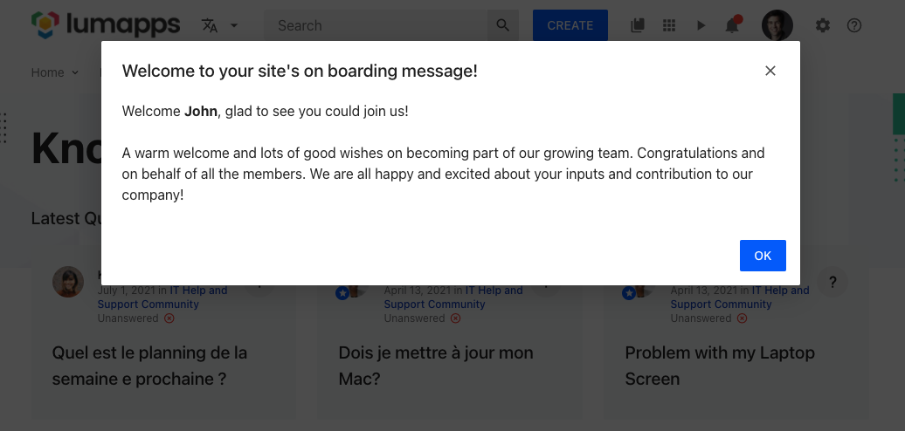

**Use case limitations and best practices**
- Showing the Dialog when the user enters the site means that each time the page is loaded, the dialog will be displayed. In that case, it is important to manage when the user has closed the dialog and open the dialog only if the user did not already close it. This can be managed by setting a variable in local storage or a cookie when the user has clicked on the **Accept** button and executing the render function only if that value was not set.
- The Dialog component is meant to be used only one time during the life cycle of a user's session. Meaning that this Dialog will be displayed, the user will close it, and the Dialog will not display again during the user's session. Reusing a Dialog and displaying it multiple times is not supported.

## Hide app launcher

In the scenario that you would want to hide the App launcher, the following snippet needs to be included in your site:

```js
window.lumapps.disable('bookmarks');
```

## Add new bookmarks

In this specific use case, we have the possibility to add new bookmarks into the App Launcher. Bookmarks can be added either as the first elements of the list or the last ones

```js
window.lumapps.customize(({ targets, components, render, placement, constants }) => {
    const { Bookmark } = components;

    render({
        placement: placement.RIGHT,
        target: targets.BOOKMARKS_ITEMS,
        toRender: Bookmark({
            className: 'widget-message',
            title: 'Test',
            link: 'https://google.com',
            icon: 'https://link-to-image.com',
        }),
    });
});
```

## Add new button on the rich text editor toolbar (widget RTE, article or event)

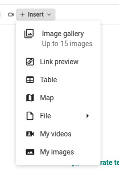

In this use case, you'll probably want to have a new button on the rich text editor toolbar allowing you to insert specific elements from an external provider.

```js
window.lumapps.customize(
  ({ targets, components, render, placement, constants, state }) => {
    const {
      DropdownSection,
      DropdownItem,
      RawHTML,
      FlexBox,
      Button,
      List,
      ListItem,
    } = components;
    const { Orientation, Size, Emphasis, Alignment } = constants;

    /** Fetch the items from your external provider
     * You can use our api wrapper(https://lumapps.github.io/customizations-api-doc/javascript/api.html#api-1)
    */
    const fetchItems = async () => {
      const fetchedItems = new Promise((resolve) => {
        setTimeout(() => {
          resolve([
            { id: "54", title: "First item", src: "https://lumapps.com" },
            { id: "57", title: "Second item", src: "https://picsum.photos/" },
          ]);
        }, 500);
      });
      return fetchedItems;
    };

    /** Callback on search button click 
    * - Fetch external items
    * - Render those items on a list
    */
    async function onItemsSearch() {
      const context = state.get("context");
      const input = document.querySelector("input#items-search-input");
      const searchQuery = input.value;

      // Trigger the loading state of the dialog while we fetch items
      context.openWrexConfigurationDialog({
        isLoading: true,
      });

      const items = await fetchItems();

      const { componentToRender } = setupConfiguration({ items, searchQuery });

      await context.openWrexConfigurationDialog({
        componentToRender,
        isLoading: false,
      });
    }

    /** Callback when the user select an item from the list 
     * - Update the attributes on the element we want to insert
     * - Rerender the list to display the selected state on the item
    */
    const onItemPickChange = (item, configurationData) => {
      const context = state.get("context");

      context.setWrexIframeAttributes({
        src: item.src,
        provider: "my-website",
      });

      const { componentToRender } = setupConfiguration({
        ...configurationData,
        selectedItemId: item.id,
      });

      context.openWrexConfigurationDialog({
        componentToRender,
      });
    };

    /** 
     * Return the components to render on the configuration dialog
     * - Display only an input + a search button without fetched items
     * - Display the items in a list when available
    */
    function setupConfiguration(configurationData = {}) {
      const { items, searchQuery, selectedItemId } = configurationData;
      const componentsToDisplay = [
        FlexBox({
          children: [
            // Note: this allow to display an input the same way as other place of the product 
            RawHTML({
              html: `
                <div class="lumx-text-field lumx-text-field--has-input lumx-text-field--has-label lumx-text-field--theme-light">
                  <div class="lumx-text-field__wrapper">
                      <div class="lumx-text-field__input-wrapper">
                          <input type="text" id="items-search-input" class="lumx-text-field__input-native lumx-text-field__input-native--text" value="${
                            searchQuery || ""
                          }" placeholder="Search an item">
                      </div>
                  </div>
                </div>`,
            }),
            Button({
              children: "Search",
              emphasis: Emphasis.low,
              onClick: onItemsSearch,
            }),
          ],
          orientation: Orientation.horizontal,
          gap: Size.regular,
          hAlign: Alignment.center,
        }),
      ];

      if (items && items.length > 0) {
        const listItems = [];

        for (const item of items) {
          listItems.push(
            ListItem({
              children: item.title,
              size: Size.tiny,
              onItemSelected: () => onItemPickChange(item, configurationData),
              isSelected: selectedItemId === item.id,
            })
          );
        }

        componentsToDisplay.push(
          List({
            children: listItems,
          })
        );
      }

      const componentToRender = FlexBox({
        children: componentsToDisplay,
        orientation: Orientation.vertical,
        gap: Size.huge,
      });

      return { componentToRender };
    }

    /** Callback when the user click on our video custom button */
    const onVideoButtonClick = async (context) => {
      state.set("context", context);
      const { componentToRender } = setupConfiguration();

      context.openWrexConfigurationDialog({
        componentToRender,
      });
    };

    render({
      placement: placement.UNDER,
      target: targets.WREX_TOOLBAR,
      toRenderWithContext: (context) => {
        return DropdownSection({
          children: [
            DropdownItem({
              title: "My videos",
              icon: "video-account",
              onClick: () => onVideoButtonClick(context),
            }),
          ],
        });
      },
    });
  }
); 
```
### Use case information

**openWrexConfigurationDialog** Function

Open the configuration dialog and allows you to define his content.

| Parameter | Description | Is required? | Option type | Default Value |
|-----------|------|----------|---------|-------------|
| `configuration` | Configuration options | Yes | object | `{}` |
| `configuration.componentToRender` | The component to render inside the dialog | Yes | Component | `undefined` |
| `configuration.isLoading` | Whether the dialog should be in a loading state | No | boolean | `false` |

**setWrexIframeAttributes** Function

Allows you to define the data of the iframe to insert

*Note: calling this function will not insert an iframe, the insertion is done through the configuration dialog*

| Parameter | Description | Is required? | Option type | Default Value |
|-----------|------|----------|---------|-------------|
| `attributes` | Configuration options | Yes | object | `{}` |
| `attributes.src` | The url of the page to embed | Yes | string | `undefined` |
| `attributes.srcDoc` | The html content of the iframe | No | string | `undefined` |
| `attributes.title` | The title of the iframe, used for accessibility | No | string | `undefined` |
| `attributes.provider` | The name of the provider of the iframe, used to identify an iframe | No | string | `undefined` |

**setWrexImageAttributes** Function

Allows you to define the data of the image to insert

*Note: calling this function will not insert an image, the insertion is done through the configuration dialog*

| Parameter | Description | Is required? | Option type | Default Value |
|-----------|------|----------|---------|-------------|
| `attributes` | Configuration options | Yes | object | `{}` |
| `attributes.title` | The caption of the image group | No | string | `undefined` |
| `attributes.images` | The image(s) to display | Yes | Image[] | `[]` |

**Image** Object

| Parameter | Description | Is required? | Option type | Default Value |
|-----------|------|----------|---------|-------------|
| `src` | The image url | Yes | string | `''` |
| `alt` | The image alt text, should describe the image for accessibility purpose | No | string | `''` |
| `height` | The image height (in px) | No | integer | `undefined` |
| `width` | The image width (in px) | No | integer | `undefined` |

## Disabling bookmarks

Bookmarks can be disabled in order to avoid them to be displayed by adding the following line of JavaScript to your site.

```js
window.lumapps.disable('bookmarked-apps-docs');
```

The ID used is retrieved from the bookmarks HTML, where each bookmark has the `id` attribute.

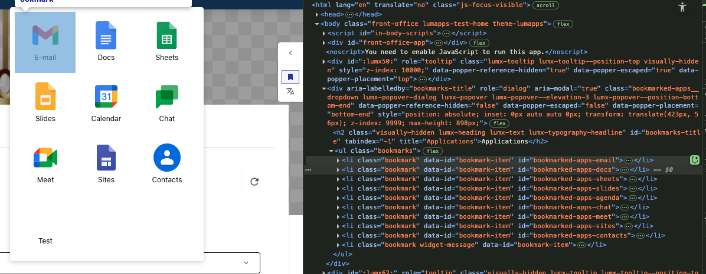

## Display a message above all pages of a certain type

In this use case, we are displaying a message oon all pages of a certain type. This should be used when an important message wants to be conveyed for all pages of a site in a quick and efficient way.

This customization can be executed with `target.COMMUNITY` if the message should only be displayed on communities, or `target.CONTENT` if the message should only be displayed on contents.

```js
window.lumapps.customize(({ targets, components, render, placement, constants }) => {
    const { Message } = components;
    const { Kind } = constants;
    const desiredTarget = targets.COMMUNITY; // or targets.CONTENT

    render({
        placement: placement.ABOVE,
        target: desiredTarget, 
        toRender: Message({
            className: 'message',
            kind: Kind.info,
            children: `All pages of the ${desiredTarget} type will see this message!`,
            hasBackground: true,
        }),
    });
});
```

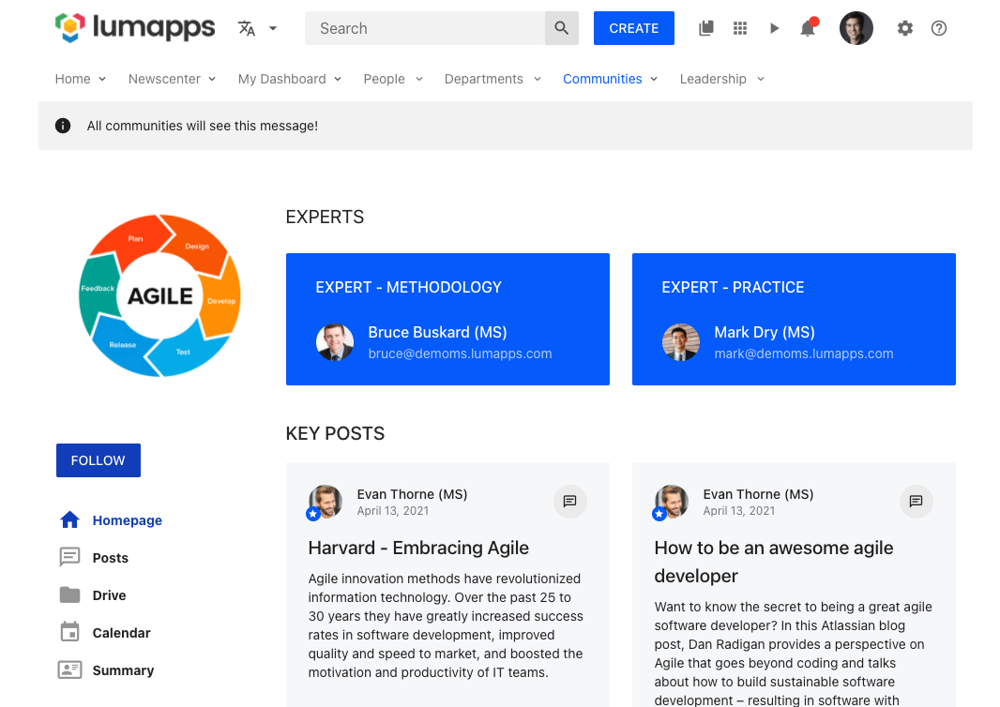

**Use case limitations and best practices**
- This customization could be combined with `window.lumapps.getCurrentContent()` in order to render the message on just a few pages, by checking their ID. However, in those scenarios we recommend adding a widget to those pages rather than executing a customization.

## Create a Copy Link to Content action

The contextual actions menu displays a set of actions that can be executed on the currently displayed content. It is a great place to add custom actions to your contents. For example, let's say that you want to add a `Copy link to content` action, that will copy the current content's link to the clipboard.

```js
window.lumapps.customize(({ targets, components, render, placement, constants }) => {
    const { ListItem, Icon } = components;
    const { Size } = constants;

    const onClick = () => {
        /**
         * Copying to the clipboard requires the creation of a DOM element that will serve
         * as the placeholder for the text to be copied. In order to copy the URL, we create
         * a textarea, replace the text for the `window.location.href` value and then execute
         * the `document.execCommand('copy')`.
         */
        const copyingTextArea = document.createElement('textarea');
        copyingTextArea.value = window.location.href;

        document.body.appendChild(copyingTextArea);

        copyingTextArea.select();
        document.execCommand('copy');

        document.body.removeChild(copyingTextArea);

        /** Displaying an alert in order to let the user know that the copy was a success is always a best practice */
        alert('Content URL copied to clipboard!')
    }

    render({
        placement: placement.UNDER,
        target: targets.CONTEXTUAL_ACTIONS,
        toRender: ContextualAction({
            /** The action label translation key. */
            labelKey: 'Copy link',
            /** The action which can be either a link or a callback. */
            action: onClick,
            /** The action icon to display in the contextual menu. */
            icon: 'content-copy',
            /** Whether or not the action is disabled. */
            isDisabled: false,
            /** Whether the action should appear selected or not. */
            isSelected: false,
            /** The action tooltip label translation key. */
            tooltipLabelKey: 'Copy link from current content',
        }),
    });
});
```

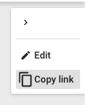

If the action that you are creating needs to retrieve information from the current content in order to create a URL, you can use the `getCurrentContent` function available on the `window.lumapps` variable. Let's say that you want to create a URL that uses the content's id and that opens a new tab.


```js
window.lumapps.customize(({ targets, components, render, placement, constants }) => {
    const { ContextualAction } = components;
    const { Size } = constants;
    /**
     * This retrieves the current displayed content, so it can be used as input for creating the customization.
     */
    const currentContent = window.lumapps.getCurrentContent();

    render({
        placement: placement.UNDER,
        target: targets.CONTEXTUAL_ACTIONS,
        toRender: ContextualAction({
            /** The action label translation key. */
            labelKey: 'Action',
            /** The action icon to display in the contextual menu. */
            icon: 'content-copy',
            /** Whether or not the action is disabled. */
            isDisabled: false,
            /** Whether the action should appear selected or not. */
            isSelected: false,
            /** The action tooltip label translation key. */
            tooltipLabelKey: 'Do something',
            /** Since we are displaying a link and not a clickable action, we pass link properties to the `action` property in order to configure our link */
            action: {
                href: `https://external.url.com/content/${currentContent.id}`,
                target: '_blank',
            },
        }),
    });
},
/**
 * Customizations by default are not re-rendered when there is a navigation on the page. This allows the application to remain responsive and avoid
 * unnecessary re-renders since these customizations are 90% of the time the same, no matter the page they are in. For the cases where we need to access
 * the information coming from the current content, an additional parameter can be passed to the `window.lumapps.customize` function, letting the frontend
 * application know that this customization needs to be rendered on navigation. That way, when the user navigates between contents, the URL on the contextual
 * actions will be up to date.
 */
{
    shouldRenderOnNavigation: true,
});
```

**Use case limitations and best practices**
- In order to maintain a visual coherence on the contextual actions menu, the best components to use for these types of customizations are ListItems. Using other components will result in a non-optimal user interface, possibly hurting the user experience. Furthermore using other components in this customization is a not supported feature.
- Avoid using `shouldRenderOnNavigation` configuration if possible, re-rendering customizations may have an impact on the performance of the application. This option should only be used if there is no other possible solution to retrieve the content's information (like retrieving the URL from `window.location.href`).

## Adding new actions on the top bar

In order to allow the users of the site to have additional quick access to other tools within your enterpise, adding components to the top bar of your site can be a great solution.

For example, if you want to add a button with a link between the contribution button and the search box, the following snippet will add one, allowing users to be redirected to an external page.

```js
window.lumapps.customize(({ targets, components, render, placement }) => {
    const { IconButton } = components;

    render({
        placement: placement.RIGHT,
        target: targets.SEARCH_BOX,
        toRender: IconButton({
            /** Usage of lumapps base CSS classes that allow adding margin or padding using the base spacing units */
            className: 'lumx-spacing-margin',
            /** id of the icon to be displayed */
            icon: 'help',
            /** link for the button */
            href: 'https://portal.help.com',
            /** how the link should be opened */
            target: '_blank'
        }),
    });
});
```

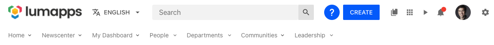

**Use case limitations and best practices**
- Please take into consideration how many items you already have in your main navigation, specially the ones added as directories. Adding a lot of items on the top bar can eventually result in unwanted behavior since the top bar as a fixed width of `1128px` in desktop. If the total amount of items on the top bar exceeds that length, icons will be displayed in several lines, which will provide a look & feel that will not appeal to your users.
- Also consider that the icons added to the top bar with the customizations API will display on the responsive version of the page, so adding a lot of icons may also result in unwanted behavior on the responsive version. If you want to avoid showing the icon in responsive version, please take a look at the [detailed api](#detailed-api) for more information.
- In order to maintain a visual coherence on the top bar, the best components to use for these types of customizations are Buttons or Icon Buttons. Using other components will result in a non-optimal user interface, possibly hurting the user experience.

## Adding links to the contribution menu

The contribution menu displays a set of links for creating content on the site. If you have other utilities that allow creating content, this contribution menu can be an ideal place for adding links that connect LumApps with those utilities. For example, let's say that you want to connect your users to Medium, so they have a quick access for creating articles:

```js
window.lumapps.customize(({ targets, components, render, placement }) => {
    const { DropdownSection, DropdownItem } = components;

    render({
        placement: placement.UNDER,
        target: targets.CONTRIBUTION_MENU,
        toRender: DropdownSection({
            children: DropdownItem({
                title: 'New Medium Article',
                icon: 'message-text',
                href: 'https://medium.com/new-story',
            }),
            header: 'Medium',
        }),
    });
});
```

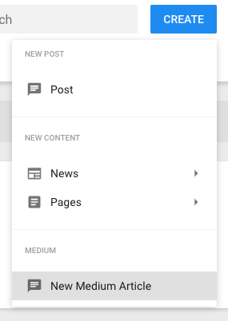

**Use case limitations and best practices**
- In order to maintain a visual coherence on the contribution menu, the best components to use for these types of customizations are `DropdownSection` and `DropdownItem`. Using other components will result in a non-optimal user interface, possibly hurting the user experience. Furthermore using other components in this customization is a not supported feature.

## Add an additional logo or badge depending on the current user

The logo target allows developers to add a customization to the left or to the right hand side of the logo. In this use case, we will be adding a badge to the right hand side of the logo when the user is a site admin. This can be done by combining the `Badge` component with the `session.user` object, by only adding the customization if `session.user.isAdmin` is `true`.

```js
window.lumapps.customize(({ targets, components, render, placement, session }) => {
    const { Badge } = components;
    const { user } = session;

    if (user.isAdmin) {
        render({
            placement: placement.RIGHT,
            target: targets.LOGO,
            toRender: Badge({
                children: 'A',
                className: 'admin-badge',
            }),
        });
    }
});
```

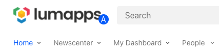

In order to make the badge display on top of the logo, a small CSS adjustment needs to be made. This is the code used for the purpose of this use case:

```css
.admin-badge {
    margin-top: 15px;
    margin-left: -5px; // use a negative margin so the badge displays on top of the logo.
}
```

## Hide the entire navigation on your site

If your site does not need a navigation and you want to avoid the space that the navigation occupies, you can use the following code snippet to hide the navigation and adjust your site to profit from that additional space.

**IMPORTANT:** If you are trying to hide the navigation on your site, please use this approach and avoid hiding it with CSS. This method will provide you an increase in performance as well as in user experience.

```js
window.lumapps.disable('navigation');
```

This snippet will:
- Avoid the display of the navigation's UI.
- Avoid any XHR requests that are executed in order to retrieve the navigation's data.
- Avoid downloading the javascript code needed to display the navigation.

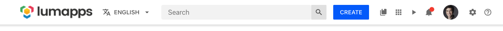

In order to make this customization work as expected, an additional CSS and some configuration to your site needs to be added in order to achieve the expected behaviour:

```css

// move the box-shadow to the header rather than the navigation and add the box shadow
// to the server side rendered header
.header-top,
.inline-header-top {
    box-shadow: 0 4px 4px 0 rgb(0 0 0 / 12%);
}

// the LumApps web application has a skeleton for the navigation already rendered
// from our backend application. The skeleton needs to be removed so that the loading
// state of the application does not display the navigation
.inline-main-nav {
    display: none;
}

// This padding compensates the fact that the navigation is no longer displayed on the page.
#front-office-app,
.app-content .header-content {
  padding-top: 60px !important; 
}
```

**Use case limitations and best practices**
- In order to really disable the navigation, we recommend using this approach instead of hiding the navigation with just CSS.
- Please consider changing or adjusting the size of your [slideshow](https://docs.lumapps.com/docs/explore-l0285322674420444) accordingly.

## Hide the entire sub navigation on your site

If your site does not need the child's navigation and you want to avoid the space that the navigation occupies, you can use the following code snippet to hide the sub navigation and adjust your site to profit from that additional space.

**IMPORTANT:** If you are trying to hide the sub navigation on your site, please use this approach and avoid hiding it with CSS. This method will provide you an increase in performance as well as in user experience.

```js
window.lumapps.disable('sub-navigation')
```

This snippet will:
- Avoid the display of the sub navigation's UI.
- Avoid any XHR requests that are executed in order to retrieve the navigation's data.
- Avoid downloading the javascript code needed to display the navigation.

**Use case limitations and best practices**
- In order to really disable the sub navigation, we recommend using this approach instead of hiding it with just CSS.

## Create a custom navigation for your site

In this use case, we will use the customizations API in order to disable the out-of-the-box UI for the site's navigation and render our own custom navigation instead. This customization has two steps:

1. Disable the navigation ui

```js
window.lumapps.disable('navigation-ui');
```

This snippet will:
- Avoid the display of the sub navigation's UI.
- However it will not disable any XHR requests that are executed in order to retrieve the navigation's data. This is intended since we can then reuse the data fetched in order to render our own navigation.

2. Retrieve the promise for the navigation's data from `session.navigations.getCurrent()` and use the data to render a custom navigation.

```js
window.lumapps.customize(({ targets, components, render, placement, session }) => {
    const { navigations, language } = session;
    const { Link, FlexBox } = components;

    // We retrieve the promise for the current site's navigation and use the response.
    navigations.getCurrent().then((navigationItems) => {
        render({
            target: targets.NAVIGATION,
            placement: placement.REPLACE,
            toRender: FlexBox({
                // You can reuse the class for the navigation
                className: 'main-nav__wrapper',
                children: navigationItems.map((item) => {
                    return Link({
                        // Add some margin between the elements
                        className: 'lumx-spacing-margin-right',
                        // Use the navigation item title to render the text. Here you should use the
                        // current user's language coming from `session.language` or retrieve the first translation available or use directly the title
                        // if there is nothing defined for the current language
                        children: item.title[language] || item.title[Object.keys(item.title)[0]] || item.title,
                        // Retrieve
                        href: item.url ? window.lumapps.getInternalUrl(`/${item.url}`) : null,
                    });
                }),
            }),
        });
    });
});
```

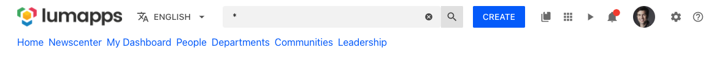

In addition to this JS snippet, we recommend that you include the following CSS to your page:

```css
// This will avoid displaying the navigation while your JS customization is loading.
.header-main-nav,
.inline-main-nav {
    display: none;
}
```

If your site has the [navigation inheritance](https://docs.lumapps.com/docs/explore-l0914183586055497inheritance) feature enabled, you can still use the snippet displayed above but you will need to decide which navigation you want to replace.

If you want to replace the parent site's navigation (which is the main navigation displayed at the top of your site), you need to use the `session.navigations.getParent()` promise instead of `session.navigations.getCurrent()`.

## Display a message across your entire site

If there is an important message that you want to display on all pages, no matter their type, you can use the customizations API to print a message above each page with the following snippet.

```js
window.lumapps.customize(({ targets, components, render, session, placement, constants }) => {
    const { Message } = components;
    const { Kind } = constants;

    render({
        placement: placement.ABOVE,
        target: targets.PAGE,
        toRender: Message({
            className: 'customizations-wrapper',
            kind: Kind.warning,
            children: 'This site won\'t be accessible between 10PM and 11PM PST due to maintenance',
            hasBackground: true,
        }),
    });
});
```

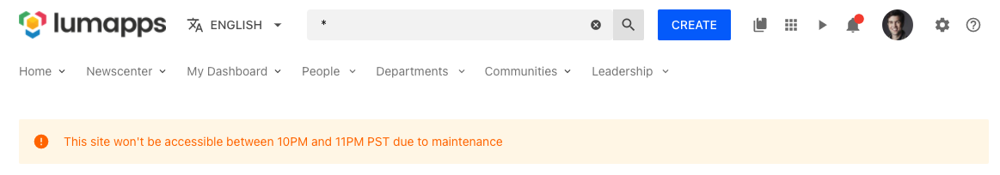

**Use case limitations and best practices**
- The target `PAGE` makes this customization appear on every single page of your site (excluding the administration interface). Please take a look at the [api](./api) to see how you can narrow down which page you want to target.
- When using slideshows or changing the content position (via the administration interface), this customization could possibly generate different results depending on the page. Please make sure that when adding a customization like this, it is displayed correctly on every type of page. If you are combining slideshows with negative content positions, this might not be a customization you want to use.

If you want more control on which pages you want the customization to appear, you have two alternatives:
- Use a more specific target and rendering multiple customizations using the list of [targets](api.md#pages)
- Use the `toRenderWithContext` and retrieve the type of page displayed, and then define for which targets you want the customization to be displayed

For example, this customization only renders a Message when the page is either a playlist or a video page.

```js
window.lumapps.customize(({ targets, components, render, session, placement, constants }) => {
    const { Message } = components;
    const { Kind } = constants;

    render({
        placement: placement.ABOVE,
        target: targets.PAGE,
        toRenderWithContext: (context) => {
            if ([targets.PLAYLIST, targets.VIDEO].includes(context.type)) {
                return (
                    Message({
                        className: 'customizations-wrapper',
                        kind: Kind.warning,
                        children: 'This site won\'t be accessible between 10PM and 11PM PST due to maintenance',
                        hasBackground: true,
                    })
                );
            }

            return null;
        },
    });
});
```

## Disable the search box

```js
window.lumapps.disable('search-box');
```

Adding this code snippet to the application will hide the search box from your LumApps site.

## Add links to other administration tools

The settings target is a great way of adding links that will only be displayed for users that have the sufficient access rights to see the [settings icon](https://docs.lumapps.com/docs/explore-l3451406716743173#l34173657923168954).

For example, with the following snippet you will be able to add a link towards managing your Medium account:

```js
window.lumapps.customize(({ targets, components, render, placement, session, api, constants }) => {
    const { RawHTML } = components;
    const { Orientation, Size, ColorPalette } = constants;

    const { DropdownSection, DropdownItem } = components;

    render({
        placement: placement.ABOVE,
        target: targets.SETTINGS,
        toRender: DropdownSection({
            children: DropdownItem({
                title: 'Manage Medium account',
                icon: 'message-text',
                href: 'https://medium.com',
            }),
            header: 'Medium',
        }),
    });
});
```

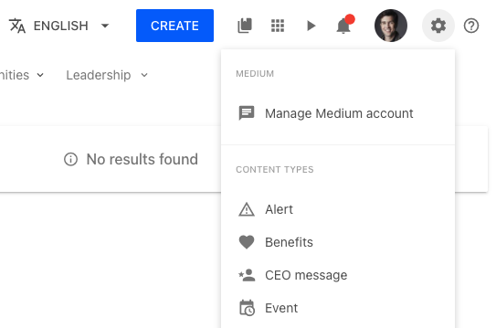

## Disable the sticky header

You can disable the functionality that fixes the header to the top of the page using a combination of JS and CSS:

```js
window.lumapps.disable('sticky-header');
```

```css
.header-top {
    position: initial !important;
}

.header-main-nav {
    position: initial !important;
}
```

## Adding a customization to a widget

The following customization adds an HTML block at the top of the given widget.

```js
window.lumapps.customize(({ components, placement, render }) => {
    const { RawHTML } = components;

    render({
        placement: placement.ABOVE,
        // ID retrieved from inspecting the HTML of the page and focusing on the `article` tag that surrounds the widget.`
        target: 'widget-b14fc167-f5e3-4cbb-a215-7111103eeafb',
        toRender: RawHTML({
            html: 'widget customization!',
        }),
    });
});
```

In the scenario where you want to display a customization on a widget on both the Next Gen Interface as well as the Legacy interface, you can use the `targets` property
to render the same customization on both interfaces.

```js
window.lumapps.customize(({ components, placement }) => {
    const { RawHTML } = components;

    props.render({
        placement: placement.ABOVE,
        targets: 
            [
                // ID retrieved from inspecting the HTML of the page and focusing on the `article` tag that surrounds the widget
                // The attribute to retrieve is `id`
                'widget-b14fc167-f5e3-4cbb-a215-7111103eeafb',
                // ID retrieved from inspecting the HTML of the page and focusing on the `div` tag that surrounds the widget
                // The attribute to retrieve is `id`
                'widget-744017b8-a61e-11ec-be8f-bdc334d7377c-5086421325447168',
            ],
        toRender: RawHTML({
            html: 'widget customization!',
        }),
    });
});
```

**Use case limitations and best practices**
- This use case should only be used when the other customization options for a widget are not enough.

## Add a reading time estimate to an HTML widget

The following customisation retrieves the HTML from a certain HTML widget and renders the estimate reading time above the widget.

```js
window.lumapps.customize(({ components, placement, render }) => {
    const { Text } = components;

    render({
        placement: placement.ABOVE,
        // ID retrieved from inspecting the HTML of the page and focusing on the `article` tag that surrounds the widget
        // The attribute to retrieve is `id`
        target: 'widget-b14fc167-f5e3-4cbb-a215-7111103eeafb',
        toRenderWithContext: (context) => {
            var wpm = 240; //average adult words per minute
            var nw = context.html.split(/\s/g).length;
            var rt = parseInt(nw / wpm); //the actual reading time
            var outString;
            if (rt == 0) outString = "less than a minute";
            else outString = rt + " minute" + (rt != 1 ? "s" : "");

                return Text({
                    children: `Estimating reading time: ${outString}`,
                });
            },
    });
});
```

This can also be achieved with the widget's identifier, which can be added via the editor, on the Style > Advanced > Identifier field

```js
window.lumapps.customize(({ components, placement, render }) => {
    const { Text } = components;

    render({
        placement: placement.ABOVE,
        // widget's identifier, which can be added via the editor, on the Style > Advanced > Identifier field
        target: 'widget-estimate-reading-time',
        toRenderWithContext: (context) => {
            var wpm = 240; //average adult words per minute
            var nw = context.html.split(/\s/g).length;
            var rt = parseInt(nw / wpm); //the actual reading time
            var outString;
            if (rt == 0) outString = "less than a minute";
            else outString = rt + " minute" + (rt != 1 ? "s" : "");

                return Text({
                    children: `Estimating reading time: ${outString}`,
                });
            },
    });
});
```

## Adding components to the main navigation

In the following use case, we are using the target `NAVIGATION` and placement `RIGHT` to render a custom dropdown on the right hand side of the navigation, so we can profit from the extra space and display some useful links to our users.

```js
window.lumapps.customize(({ targets, components, render, placement }) => {
    const { DropdownSection, DropdownItem, Dropdown } = components;

    render({
        placement: placement.RIGHT,
        target: targets.NAVIGATION,
        toRender: Dropdown({
            children: DropdownSection({
                children: [
                    DropdownItem({
                        title: 'Google Drive',
                        icon: 'message-text',
                        href: 'https://medium.com',
                    }),
                    DropdownItem({
                        title: 'Google Docs',
                        icon: 'message-text',
                        href: 'https://medium.com',
                    }),
                    DropdownItem({
                        title: 'Google Slides',
                        icon: 'message-text',
                        href: 'https://medium.com',
                    }),
                ],
                header: 'Google',
            }),
            label: 'Utils',
        }),
    });
});
```

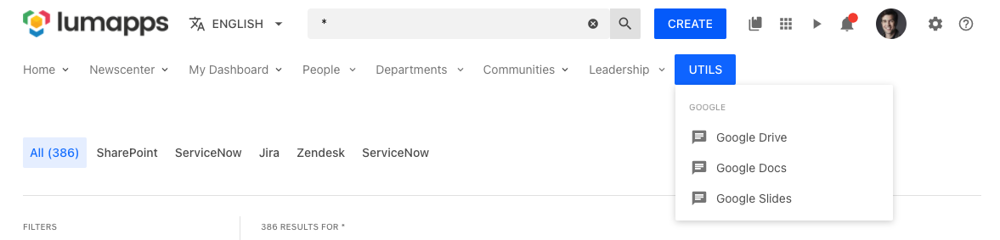

## Querying an external service

Sometimes in order to customize your site, you will need to execute an XHR request in order to obtain data from an external service. For example, let's say that you want to display the current weather in Paris on all your pages. For that, we can use an external service like [Open Weather map](https://openweathermap.org/) in order to retrieve that data, and then display it using the Customizations API.

```js
window.lumapps.customize(({ api, components, render, constants, placement, targets }) => {
    const { FlexBox, RawHTML } = components;
    const { Orientation } = constants;

    fetch('https://api.openweathermap.org/data/2.5/weather?lat=48.8563223&lon=2.3159289&units=metric&appid=<YOUR APP ID>')
    .then((response) => response.json())
    .then((data) => {
        const currentWeather = `<span>Weather in Paris: ${data.weather[0].main} (${data.main.temp} C)</span>`;

        render({
            placement: placement.ABOVE,
            target: targets.PAGE,
            toRender: FlexBox({
                className: 'weather-in-paris',
                orientation: Orientation.horizontal,
                children: RawHTML({ html: currentWeather }),
            }),
        });
    });
});
```

**IMPORTANT:**: When using the `RawHTML` component in order to create HTML without LumApps already created components, it is highly likely that you will need to combine this with the CSS Customizations feature in order to add style to your raw HTML. Please take a look at that documentation [here](../css/index)

## Querying an internal service

You can also use the `api` to query an internal LumApps service. Please keep in mind that these services need to be queried using their relative path, not their absolute one.

So for example, if you are querying the stock exchange API, you will need to use the relative URL rather than the absolute one:
- Absolute URL: `https://sites.lumapps.com/_ah/api/lumsites/v1/stockexchange/get?symbol=SYMBOL`
- Relative URL: `/_ah/api/lumsites/v1/stockexchange/get?symbol=STLA.MI`


```js
window.lumapps.customize(({ api, components, render, constants, placement, targets }) => {
    const { FlexBox, RawHTML } = components;
    const { Orientation } = constants;

    /**
     * api is an axios instance that allows you to execute internal XHR requests only. Please take a look at the   specific documentation for this in the detailed API section.
     */
    api.get('/_ah/api/lumsites/v1/stockexchange/get?symbol=STOCK').then((response) => {
        const { data } = response;

        const currentPrice = `<span>Stock price: ${data.values.current}</span>`;

        render({
            placement: placement.ABOVE,
            target: targets.PAGE,
            toRender: FlexBox({
                className: 'stock',
                orientation: Orientation.horizontal,
                children: RawHTML({ html: currentPrice }),
            }),
        });
    });
});
```

## Display a badge next to a user's profile field

Using the target `USER_PROFILE_HEADER_FIELDS`, we can display custom information about the user, that can be retrieved from an external service.

For example, 

```js
window.lumapps.customize(({ targets, components, render, placement, constants }) => {
    const { Text } = components;
    const onlineUsers = {}; // information retrieved from an external service.

    render({
        placement: placement.LEFT,
        target: targets.USER_PROFILE_HEADER_FIELDS,
        toRenderWithContext: (context) => {
            if (onlineUsers[context.user.uid]) {
                return Text({
                    color: 'green',
                    children: 'Online',
                });
            }

            return Text({
                color: 'red',
                children: 'Offline',
            });
        },
    });
});
```

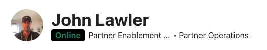

## Display an icon next to each search tab

One way to make search tab easier to differenciate is to add an icon next to each tabs. By using search tab id, it is possible to add an icon on the left side of the tab label. Tab id can be retrieved from the search call response within the `tabs` array.

```js
  window.lumapps.customize(({ targets, components, render, placement }) => {
    const { Icon } = components;
    const tabs = [
        { uid: 'all', icon: 'home-circle' },
        { uid: 'drive', icon: 'google-drive' },
    ];

    render({
        placement: placement.LEFT,
        target: targets.SEARCH_TAB,
        toRenderWithContext: id => {
            // search in tabs object if an id matches with the id of a tab that should to have an icon
            const tabToFormat = tabs.find(tab => tab.uid === id);
            // if no match have been found return to avoid unnecessary warnings
            if (tabToFormat === undefined) return;
            return Icon({
                icon: tabToFormat.icon,
                className: 'search-filters-tab__custom-tab-icon',
            });
        },
    });
});
```

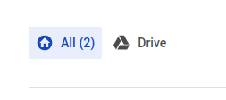

## Customize not found page error message

It is possible to customize not found error page using our design system components. If you only wish to change the error message while keeping the go back home button, you can retrieve the button props from the context and only change the rest of the page.

### Without reusing the go back home button

```js
  window.lumapps.customize(({ targets, components, render, placement, constants }) => {
    const { Card, FlexBox, Thumbnail, Text } = components;
    const { Orientation, Alignment, ThumbnailVariant, Size, ColorPalette, Typography } = constants;

    render({
        placement: placement.REPLACE,
        target: targets.NOT_FOUND_PAGE,
        toRender: FlexBox({
            children: Card({
                children: FlexBox({
                    orientation: Orientation.vertical,
                                vAlign: Alignment.center,
            hAlign: Alignment.center,
                    gap: 'huge',
                    children: [
                        Text({
                            typography: Typography.display1,
                            children: 'Oh snap!'
                        }),
                        Text({
                            typography: Typography.body1,
                            children: 'Seems that the page you were looking for has been deleted or you do not have access to it.'
                        })
                    ]
                }),
            }),
            orientation: Orientation.vertical,
            vAlign: Alignment.center,
            hAlign: Alignment.center,
            fillSpace: true,
        }),
    });
});
```

```js
window.lumapps.customize(({ targets, components, render, placement, constants }) => {
    const { Card, FlexBox, Thumbnail, Text, Icon, Button, Message } = components;
    const { Orientation, Alignment, ThumbnailVariant, Size, ColorPalette, Typography, Kind } = constants;

    render({
        placement: placement.REPLACE,
        target: targets.NOT_FOUND_PAGE,
        toRenderWithContext: ({ button }) => FlexBox({
            children: Card({
                children: FlexBox({
                    orientation: Orientation.vertical,
                                vAlign: Alignment.center,
            hAlign: Alignment.center,
                    gap: 'huge',
                    children: [
                        Icon({ size: Size.xl, hasShape: true, icon: 'file-question', key: 'icon' }),
                        Message({
                            kind: Kind.warning,
                            hasBackground: true,
                            children:
                                'Something got wrong... If this is not coming from a wrong URL, please reach your administrator.',
                            key: 'message',
                            className: 'lumx-spacing-margin-top-big',
                        }),
                        Button({
                            key: 'button',
                            className: 'lumx-spacing-margin-top-big',
                            ...button,
                            leftIcon: 'home',
                        }),
                    ]
                }),
            }),
            orientation: Orientation.vertical,
            vAlign: Alignment.center,
            hAlign: Alignment.center,
            fillSpace: true,
        }),
    });
});
```

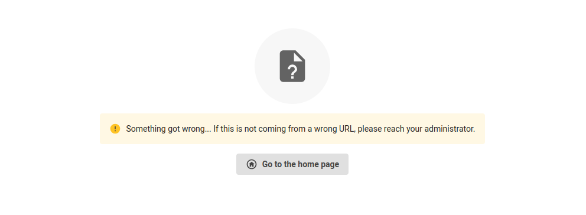


## Replace icons for a specific result type

The following script uses the target `targets.SEARCH_RESULT_ICON` and the placement `placements.REPLACE` in order to replace the default icon used for a specific entity (here, `posts` with a `message-text-outline` default icon) by another mdi icon (`typewriter`).

```js
window.lumapps.customize(({ targets, components, render, placement }) => {
    const { SearchThumbnail } = components;
    render({
        placement: placement.REPLACE,
        target: targets.SEARCH_RESULT_ICON,
        toRenderWithContext: ({ currentProps, entityType, mimeType }) => {
            return SearchThumbnail({
                ...currentProps,
                icon: entityType === 'post' ? 'typewriter' : currentProps.icon,
            });
        },
    });
});
```

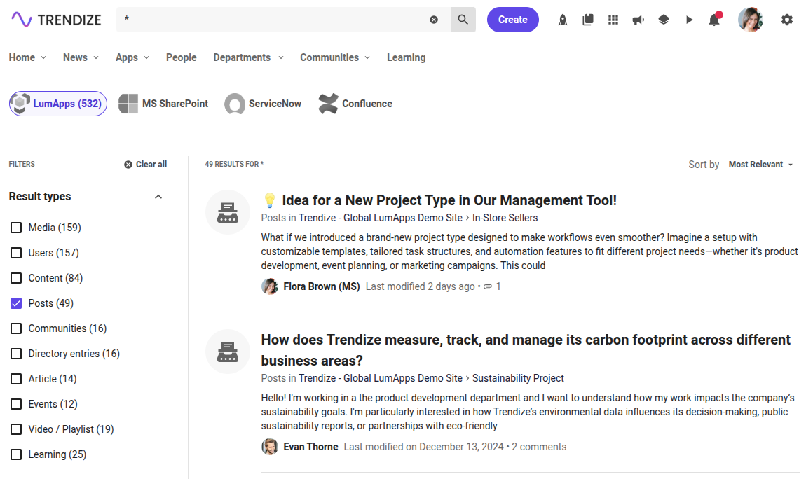

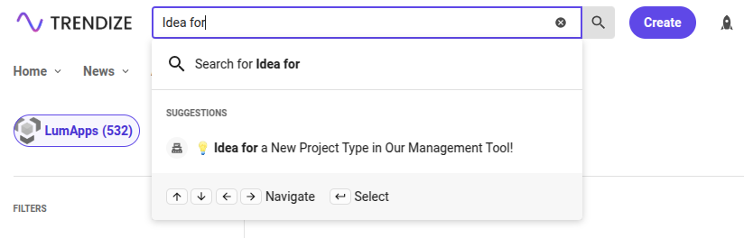

## Replace icons with a custom svg

The following script uses the target `targets.SEARCH_RESULT_ICON` and the placement `placements.REPLACE` in order to replace the default icon used for a specific entity (here, `posts` with a `message-text-outline` default icon) by a custom svg path.

**Note:** By default, search results icons are displayed using the `icon` prop that uses mdi names. In order to override this and use a custom svg, we need to set this prop to `null` and use `iconPath` instead.

```js
window.lumapps.customize(({ targets, components, render, placement }) => {
    const { SearchThumbnail } = components;
    render({
        placement: placement.REPLACE,
        target: targets.SEARCH_RESULT_ICON,
        toRenderWithContext: ({ currentProps, entityType }) => {
            return SearchThumbnail({
                ...currentProps,
              	icon: entityType === 'post' ? null : currentProps.icon,
                iconPath: entityType === 'post' ? 'M21.35,11.1H12.18V13.83H18.69C18.36,17.64 15.19,19.27 12.19,19.27C8.36,19.27 5,16.25 5,12C5,7.9 8.2,4.73 12.2,4.73C15.29,4.73 17.1,6.7 17.1,6.7L19,4.72C19,4.72 16.56,2 12.1,2C6.42,2 2.03,6.8 2.03,12C2.03,17.05 6.16,22 12.25,22C17.6,22 21.5,18.33 21.5,12.91C21.5,11.76 21.35,11.1 21.35,11.1V11.1Z' : undefined,
            });
        },
    });
});


```

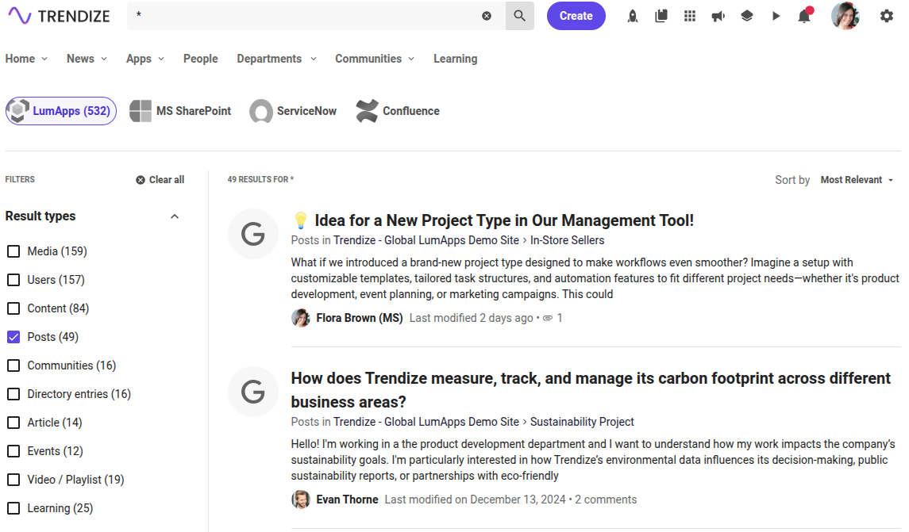
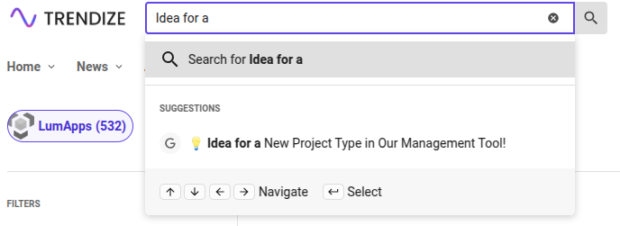

## Replace icons of documents with a specific mimetype

The following script uses the target `targets.SEARCH_RESULT_ICON` and the placement `placements.REPLACE` in order to replace the default icon used documents with a specific mimetype by another mdi icon.

```js
window.lumapps.customize(({ targets, components, render, placement }) => {
    const { SearchThumbnail } = components;
    render({
        placement: placement.REPLACE,
        target: targets.SEARCH_RESULT_ICON,
        toRenderWithContext: ({ currentProps, entityType, mimeType }) => {
            const isPdf = mimeType === 'application/pdf';
            return SearchThumbnail({
                ...currentProps,
              	icon: isPdf ? 'file-pdf' : currentProps.icon,
            });
        },
    });
});

```

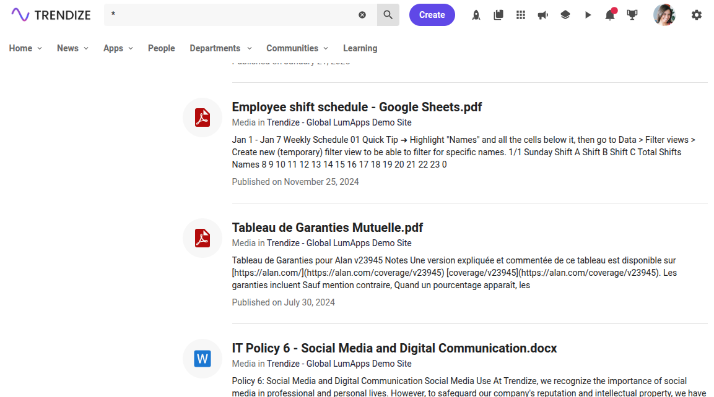

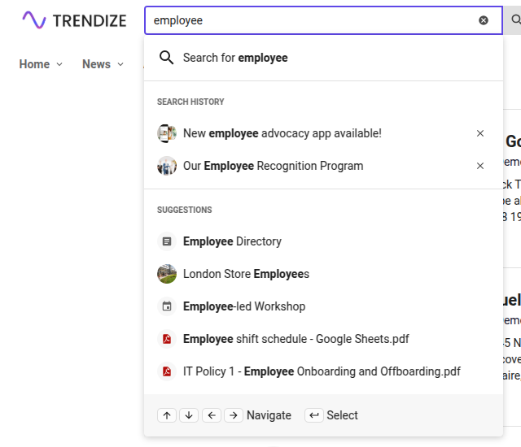

### Replace icons of documents with a specific source id

Some search engines apply a specific source identifier (ex: Google Cloud Search) that could be useful to have for a more in depth customization. You can retrieve this information via the `sourceUid` attribute.
The following script uses the target `targets.SEARCH_RESULT_ICON` and the placement `placements.REPLACE` in order to replace the default icon used by documents with a specific source identifier by another mdi icon.

**Some notes to consider:** 
* Promoted results may have different identifier as those that weren't promoted.
* Search history interactions that were added before the customization was applied may not have the `sourceUid` field available.
Users will have to manually remove them and/or re-select them in the search results to update the search history.

```js
window.lumapps.customize(({ targets, components, render, placement }) => {
    const { SearchThumbnail } = components;
    render({
        placement: placement.REPLACE,
        target: targets.SEARCH_RESULT_ICON,
        toRenderWithContext: ({ currentProps, entityType, mimeType, sourceUid }) => {
            const isMyCustomType = sourceUid === 'datasources/3a09903cb4cb4e3b42659d38599d0c37';
            return SearchThumbnail({
                ...currentProps,
              	icon: isMyCustomType ? 'file-pdf' : currentProps.icon,
            });
        },
    });
});

```
